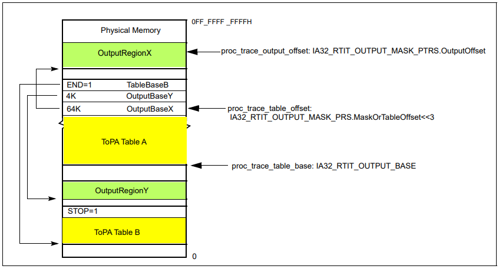
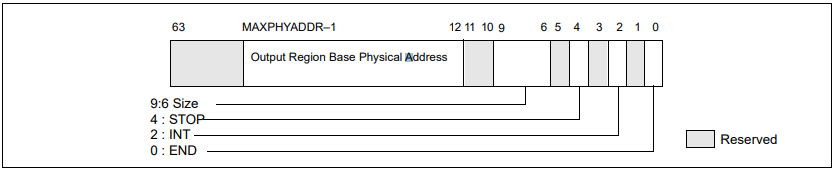

# 33.2 INTEL® PROCESSOR TRACE 운영 모델 

해당 섹션에서는 전반적인 인텔 프로세서 추적 메커니즘과 작동 방식들에 관련된 필수 개념에 대해 설명합니다.

---

## 33.2.1 COFI( 플로우 관련 명령에 대한 변경점 ) 추적

기본 프로그램 블록은 점프나 브랜치가 발생하지 않는 코드 섹션입니다. 해당 코드 블록의 명령 포인터( IP )는 프로세서가 코드의 플로우를 리디렉션하지 않고 처음부터 끝까지 실행하기 때문에 추적할 필요가 없습니다. 브랜치와 같은 명령어들과 예외 또는 인터럽트와 같은 이벤트들은 프로그램의 플로우를 변경할 수 있습니다. 프로그램의 플로우를 변경하는 명령어들과 이벤트들은 **COFI( 플로우 변경 명령어 )** 라고 불립니다. COFI에는 3가지 카테고리가 있습니다.

 - 직접 변경 COFI
 - 간접 변경 COFI
 - Far Transfer COFI

아래의 섹션에서는 추적 패킷들을 생성하는 **COFI 이벤트**에 대해 설명합니다. 표 33-1에는 COFI 유형별 브랜치 명령어가 나열되어 있습니다. ( 이에 대한 자세한 설명은 Intel® 64 와 IA-32 아키텍쳐의 소프트웨어 개발 메뉴얼을 참조해주세요 )

| COFI TYPE | INSTRUCTION |
|:---------:|:-----------:|
|     조건부 브랜치      |     JA, JAE, JB, JBE, JC, JCXZ, JECXZ, JRCXZ, JE, JG, JGE, JL, JLE, JNA, JNAE, JNB, JNBE, JNC, JNE, JNG, JNGE, JNL, JNLE, JNO, JNP, JNS, JNZ, JO, JP, JPE, JPO, JS, JZ, LOOP, LOOPE, LOOPNE, LOOPNZ, LOOPZ        | 
|      무조건 다이렉트 브랜치     |     JMP (E9 xx, EB xx), CALL (E8 xx)        |
|     간접 브랜치      |       JMP (FF /4), CALL (FF /2), RET (C3, C2 xx)      |
|     장거리 변경      |       INT1, INT3, INT n, INTO, IRET, IRETD, IRETQ, JMP (EA xx, FF /5), CALL (9A xx, FF /3), RET (CB, CA xx), SYSCALL, SYSRET, SYSENTER, SYSEXIT, VMLAUNCH, VMRESUME      |

---

### 33.2.1.1 직접 변경 COFI

직접 변경 COFI는 상대적인 브랜치입니다. 이것은 COFI 타깃이 현재 IP에서 오프셋이 명령어 바이트에 포함된 IP라는걸 의미합니다. COFI의 타깃은 소스 디스어셈블리를 통해 얻을 수 있으므로, 추적 출력에 포함시킬 필요가 없습니다. 조건부 브랜치는 브랜치를 취했는지 취하지 않았는지 여부만 표시하면 됩니다. 조건부가 아닌 브랜치들은 추적 결과들을 기록할 필요가 없습니다. 여기 2가지 하위 카테고리가 있습니다:

- 조건 분기( jcc, J*CXZ ) 및 루프

해당 유형의 명령어를 추적하기 위해 프로세서는 단일 비트( TNT )를 인코딩하여 명령어 이후의 프로그램 흐름을 나타냅니다. Jcc, J*CXZ 및 LOOP는 TNT 비트로 추적할 수 있습니다. 추적 패킷 출력 효율을 향상시키기 위해 프로세서는 여러 개의 TNT 비트를 단일 패킷으로 압축합니다.

- 조건이 없는 직접적인 점프

조건이 없는 직접적인 점프( 예: JMP 근거리 상대 또는 CALL 근거리 상대 )는 어플리케이션 어셈블리에서 직접 추론이 가능하므로, 추적 출력이 필요하지 않습니다. 조건이 없는 직접적인 점프는 TNT 비트 또는 타깃 IP 패킷을 생성하지 않지만, TIP.PGD 및 TIP.PGE 패킷은 인텔 PT를 활성화하는 조건이 없는 직접적인 점프를 통해 생성할 수 있습니다( 33.2.6 참조 ).

---

### 33.2.1.2 간접 변경 COFI

간접 변경 명령은 레지스터 또는 메모리 위치에서 IP를 업데이트하는 것을 포함합니다. 레지스터 또는 메모리 내용은 실행 중에 언제든지 변경될 수 있으므로 레지스터 또는 메모리 내용을 직접 읽을 때까지 간접 변경 대상을 알 수 있는 방법이 없습니다. 결과적으로 추적 하드웨어는 디버그 소프트웨어가 COFI의 대상 주소를 결정할 수 있도록 추적 패킷에 대상 IP를 전송해야 합니다. 이 IP는 선형이거나, effective 주소일 수 있습니다( 섹션 33.3.1.1 참조 ). 간접 변경 명령은 브랜치의 타겟 주소를 포함하는 TIP 패킷을 생성합니다. 여기에도 2가지 하위 카테고리가 있습니다:

- Near JMP Indirect 와 Near Call Indirect

앞서 언급했듯이 간접 COFI의 타겟은 레지스터 또는 메모리 위치의 내용에 있습니다. 따라서 프로세서는 디코더가 프로그램 플로우을 확인할 수 있도록 이 타겟 주소를 포함하는 패킷을 생성해야 합니다.

- Near RET

CALL 명령어가 실행되면 CALL 명령어의 다음 명령의 주소를 스택에 푸시합니다. 호출 절차가 완료되면, RET 명령어는 단순히 스택에서 POP한 주소로 프로그램 플로우을 전송합니다. 호출된 프로시저가 RET 명령어를 실행하기 전에 스택의 반환 주소를 변경할 수 있으므로 디버그 소프트웨어는 는 코드 플로우가 마지막 CALL 명령의 다음 명령어로 돌아간다고 가정하면 오류가 발생할 수 있습니다. 따라서, 따라서 RET에 가까운 경우에도 TIP가 전송될 수 있습니다.

- RET의 압축

RET의 타겟이 CALL 스택을 추적할 때 예상되는 것과 일치하는 경우 특별한 경우가 발생합니다. 디코더가 해당 CALL( "해당 CALL"은 스택 깊이가 일치하는 CALL로 정의됨 )을 보았고 RET 타겟이 해당 CALL 뒤의 명령어인 것이 확실하다면, RET 타겟은 "압축"될 수 있습니다. 압축되는 경우, 타겟 IP 패킷 대신 "taken"인 단일 TNT 비트만 생성됩니다. RET 압축의 경우 디코더가 혼동하지 않도록 하기 위해 압축 가능한 RET을 제한합니다. 주어진 논리 프로세서에서는 마지막 PSB 패킷 이후에 나타난 CALL에 해당우 RET만 압축할 수 있습니다. ( 자세한 내용은 섹션 33.4.2.2 참조 )

---

### 33.2.1.3 Far Transfer COFI

IP( 명령어 포인터 )를 변경하고, near jumps 가 아닌 연산들은 모두 "장거리 변경"입니다. 여기에는 예외, 인터럽트, traps, TSX 중단 및 far transfer을 수행하는 명령어가 포함됩니다. 모든 far transfer는 목적지 IP 주소를 제공하는 TIP 패킷을 생성합니다. 바이너리 소스에서 유추할 수 없는 far transfer( 예: 예외 및 인터럽트와 같은 비동기 이벤트 )의 경우, 이벤트가 발생한 소스 IP 주소를 제공하는 FUP 패킷( 흐름 업데이트 패킷 )이 TIP 앞에 나옵니다. 표 33-23은 far transfer에 의해 생성된 FUP에 정확이 어떤 IP가 포함되는지 나타냅니다.

## 33.2.2 Software Trace Instrumentation with PTWRITE

## 33.2.3 Power Event Tracing

## 33.2.4 Event Tracing

## 33.2.5 Trace Filtering

### 33.2.5.1 Filtering by Current Privilege Level (CPL)

### 33.2.5.2 Filtering by CR3

### 33.2.5.3 Filtering by IP

#### TraceStop

#### IP Filtering Example

#### IP Filtering and TraceStop

## 33.2.6 Packet Generation Enable Controls

### 33.2.6.1 Packet Enable (PacketEn)

### 33.2.6.2 Trigger Enable (TriggerEn)

### 33.2.6.3 Context Enable (ContextEn)

### 33.2.6.4 Branch Enable (BranchEn)

### 33.2.6.5 Filter Enable (FilterEn)

## 33.2.7 Trace Output

Intel Pt의 출력은 트레이스 내용 및 필터링 메커니즘과 별도로 보아야 한다. 트레이스 출력을 위한 옵션들은 프로세서 세대 및 플랫폼에 따라 달라질 수 있다.

트레이스 출력은 IA32_RTIT_CTL의 ToPA 및 FabricEn 비트 필드에 의해 구성된 다음 출력 체계 중 하나를 사용하여 작성된다(섹션 33.2.8.2 참조):

+ 물리적 주소 공간의 단일 연속적인 영역.

+ 물리적인 메모리 공간의 가변적인 크기 영역의 모음. 이러한 영역들은 물리적 주소의 테이블(ToPA)로 연결되어 있으며, 이를 Table of Physical Addresses(ToPA)라고 한다. 트레이스 출력 저장소는 캐시와 TLB를 우회하지만, 직렬화하지는 않는다. 이는 출력의 성능 영향을 최소화히기 위함이다.

+ 플랫폼 특화 트레이스 전송 서브시스템.

선택한 출력 체계와 상관없이, Intel PT 저장소는 기본적으로 프로세서 캐시를 우회한다. 이는 소중한 캐시 / 공간을 낭비하지 않게 하지만, 비캐시 가능(UC) 저장소와 관련된 직렬화 기능은 없다. 소프트웨어는 Intel PT 출력 영역의 특정 영역을 UC로 표시하기 위해 MTRR을 사용하는 것을 피해야한다. 왜냐하면 이렇게 하면 앞서 설명한 동작이 무시되고 Interl PT 저장소가 UC로 강제되어 심각한 성능 하락을 초래할 수 있기 때문이다.

패킷 생성 명령어가 실행되고 일정한 수의 사이클이 지난 후, 메모리 또는 다른 트레이스 종단점에 기록된다는 보장이 없다. 생성된 모든 패킷이 종단점에 도달했는지 확인하는 유일한 방법은 TraceEn을 지운 후 저장, 차단 또는 직렬화 명령을 따르는 것이다. 이렇게 하면 버퍼링된 모든 패킷이 프로세서에서 비워진다(flush).

### 33.2.7.1 Single Range Output

IA32_RTIT_CTL.ToPA 및 IA32_RTIT_CTL.FabricEn 비트가 clear되면, 트레이스 패킷 출력은 IA32_RTIT_OUTPUT_BASE(33.2.8.7 섹션 참조)의 base 주소와 IA32_RTIT_OUTPUT_MASK_PTRS(33.2.8.8 섹션 참조)의 마스크 값으로 정의된 단일 연속적인 메모리 범위로 전송된다. 이 범위 내에 있는 현재의 write 포인터도 IA32_RTIT_OUTPUT_MASK_PTRS에 저장된다. 이러한 출력 범위는 원형적이므로, write가 버퍼의 끝에 도달하면 base 주소부터 다시 시작된다.

이러한 출력 방식은 Interl PT 출력이 다음 중 하나인 경우에 가장 적합하다:

+ 충분히 큰 연속적인 DRAM 영역으로 향하는 경우

+ MMIO 디버그 포트로 라우팅 하기 위해 Interl PT 출력을 플랫폼별 트레이스 종단점(예: JTAG)으로 설정한 경우. 이 상황에서는, 특정 주소 범위가 원형적으로 작성되며 SoC는 이러한 쓰기를 가로채서 적절한 장치로 보낸다. 동일한 주소에 대한 반복적인 쓰기는 서로 덮어씌우지 않고 디버거에 의해 누적되므로, 버퍼의 원형 구조로 인해 데이터가 손실되지 않는다.

프로세서는 다음 트레이스 패킷 출력 바이트를 쓸 주소를 다음과 같이 결정한다:

`OutputBase[63:0] := IA32_RTIT_OUTPUT_BASE[63:0]`  
`OutputMask[63:0] := ZeroExtend64(IA32_RTIT_OUTPUT_MASK_PTRS[31:0])`  
`OutputOffset[63:0] := ZeroExtend64(IA32_RTIT_OUTPUT_MASK_PTRS[63:32])`  
**`trace_store_phys_addr`** `:= (OutputBase & ~OutputMask) + (OutputOffset & OutputMask)`

#### Single-Range Output Errors

만약 출력 base 및 mask가 소프트웨어에 의해 올바르게 구성되지 않은 경우, 운영 오류(섹션 33.3.10 참조)가 발생하고, 트레이싱이 비활성화된다. 단일 범위 출력과 관련한 오류 시나리오는 다음과 같다.

+ mask 값이 비연속적인 경우.  
IA32_RTIT_OUTPUT_MASK_PTRS.MaskOrTablePointer 값이 1을 가지고 있는 가장 중요한 비트보다 덜 중요한 비트 위치에 0이 있는 경우

+ Base 주소와 Mask가 정렬되지 않으며 겹치는 비트가 set된 경우.  
IA32_RTIT_OUTPUT_BASE && IA32_RTIT_OUTPUT_MASK_PTRS[31:0] > 0.

+ 부적절한 출력 오프셋  
IA32_RTIT_OUTPUT_MASK_PTRS.OutputOffset가 mask 값인 IA32_RTIT_OUTPUT_MASK_PTRS[31:0]보다 큰 경우

또한, 트레이스 패킷 출력이 제한된 메모리와 겹치는 경우에는 오류가 발생할 수 있다. 자세한 내용은 섹션 33.2.7.4를 참조하라.

### 33.2.7.2 Table of Physical Addresses (ToPA)

IA32_RTIT_CTL.ToPA이 set되고 IA32_RTIT_CTL.FabricEn이 clear하다면, ToPA 출력 메커니즘이 사용된다. ToPA 매커니즘은 테이블의 linked list를 사용한다. 그림 예시는 Figure 33-1을 참조하라. 테이블의 각각의 항목은 몇 가지의 속성 비트, 출력 영역을 가리키는 포인터, 영역의 크기를 포함한다. 테이블의 마지막 항목은 다음 테이블을 가리킬 수 있다. 이 포인터는 현재 테이블의 맨 위를 가리킬 수 있고(원형 배열인 경우), 또 다른 테이블의 base 주소를 가리킬 수도 있다. 테이블의 크기는 고정되어 있지 않으며, 다음 테이블로의 연결이 어떤 항목에서든 존재할 수 있다.

프로세서는 ToPA 테이블에서 참조된 여러 출력 영역을 통합된 버퍼로서 취급한다. 이는 하나의 패킷이 한 출력 영역과 다음 영역 사이의 경계를 넘어갈 수 있다는 것을 의미한다.

ToPA 매커니즘은 프로세서에 의해 유지되는 세 가지 값에 의해 제어된다.

+ proc_trace_table_base.  
이것은 현재 ToPA 테이블의 base의 물리적인 주소이다. 트레이싱이 활성화되면,  프로세서는 이 값을 IA32_RTIT_OUTPUT_BASE MSR에서 로드한다. 트레이싱이 활성화되는 동안, 프로세서는 proc_trace_table_base의 변경사항을 반영하여 IA32_RTIT_OUTPUT_BASE MSR을 업데이트하지만, 이러한 업데이트는 소프트웨어 실행과 동기화되지 않을 수 있다. 트레이싱이 비활성화되면, 프로세서는 MSR이 proc_trace_table_base의 최신 값을 포함하도록 보장한다.

+ proc_trace_table_offset.  
이것은 현재 사용중인 현재 테이블의 항목을 나타낸다.(이 항목에는 현재 출력 영역의 주소가 포함된다.) 트레이싱이 활성화되면, 프로세서는 IA32_RTIT_OUTPUT_MASK_PTRS\[31:7](MaskOrTableOffset)에서 값을 proc_trace_table_offset[27:3]으로 로드한다. 트레이싱이 활성화되는 동안, 프로세서는 proc_trace_table_offset의 변경 사항을 반영하여 IA32_RTIT_OUTPUT_MASK_PTRS.MaskOrTableOffset을 업데이트하지만, 이러한 업데이트는 소프트웨어 실행과 동기화되지 않을 수 있다. 트레이싱이 비활성화되면, 프로세서는 MSR이 proc_trace_table_offset의 최신 값을 포함하도록 보장한다.

+ proc_trace_output_offset.  
이것은 현재 출력 영역을 가리키는 포인터로서, 다음 write의 위치를 가리킨다. 트레이싱이 활성화되면, 프로세서는 IA32_RTIT_OUTPUT_MASK_PTRS\[63:32](OutputOffset)에서 이 값을 로드한다. 트레이싱이 활성화되는 동안, 프로세서는 proc_trace_output_offset의 변경 사항을 반영하여 IA32_RTIT_OUTPUT_MASK_PTRS.OutputOffset을 업데이트하지만, 이러한 업데이트는 소프트웨어 실행과 동기화되지 않을 수 있다. 트레이싱이 비활성화되면, 프로세서는 MSR이 proc_trace_output_offset의 최신 값을 포함하도록 보장한다.

Figure 33-1은 테이블 및 이와 연관된 포인터들에 대한 그림이다.(실제 크기와 다를 수 있다.)

Figure 33-1. ToPA Memory Illustration

ToPA 매커니즘을 통해, 프로세서는 현재 출력 영역(proc_trace_table_base 및 proc_trace_table_offset으로 식별됨)에 패킷을 기록할 수 있다. 다음 바이트가 쓰여질 해당 영역 내의 오프셋은 proc_trace_output_offset으로 식별된다. 해당 영역이 패킷 출력으로 채워지면(proc_trace_output_offset = RegionSize–1), proc_table_offset은 다음 ToPA 항목으로 이동하고, proc_trace_output_offset은 0으로 설정되고, 패킷 write가 proc_trace_table_offset에 지정된 출력 영역을 채우기 시작한다.

패킷이 기록됨에 따라, 각각의 저장소는 다음과 같이 물리적인 주소에 연결된다.
**`trace_store_phys_addr`** `:= Base address from current ToPA table entry +
proc_trace_output_offset`

최종적으로, 테이블의 모든 항목으로 표시된 영역이 모두 가득 차 있을 수 있으며, 테이블의 마지막 항목에 도달한다. END 또는 STOP 속성 중 하나를 갖는 항목은 최종 항목으로서 식별될 수 있다. END 속성은 항목의 주소가 다른 출력 영역을 가리키는 것이 아닌, 또 다른 ToPA 테이블을 가리킨다는 것을 나타냄. STOP 속성은 해당 영역이 채워지면 트레이싱이 비활성화 될 것임을 나타냄. STOP에 대한 자세한 내용은 Table 33-3 및 추후에 등장하는 STOP과 관련된 섹션 내용을 참고하라.

END 항목에 도달하면, 프로세서는 이 END 항목에 저장된 base 주소로 proc_trace_table_base를 로드하여, 현재 테이블 포인터를 새로운 테이블로 이동시킨다. proc_trace_table_offset는 0으로 리셋되고, proc_trace_output_offset도 0으로 설정되어, 패킷 write가 첫번재 항목을 나타내는 base 주소에서 재개된다.

만약 테이블에 STOP이나 END 항목이 없고 트레이스 패킷 생성이 계속 활성화된 경우, 최종적으로 최대 테이블 크기에 도달하게 될 것이다(proc_trace_table_offset = 0FFFFFF8H). 이 경우에는, 마지막 출력 영역이 채워지면 the proc_trace_table_offset와 proc_trace_output_offset 이 0으로 리셋되어 (현재 테이블의 처음으로 되돌아감) 패킷 write가 계속될 것이다.

IA32_RTIT_OUTPUT_BASE 및 IA32_RTIT_OUTPUT_MASK_PTRS MSR에 대한 ㅍ로세서 업데이트는 명령 실행과 비동기적으로 이루어진다는 것에 주목해야한다. 따라서, Intel PT가 활성화된 상태에서 이 MSR을 읽으면 오래된 값이 반환될 수 있다. IA32_RTIT_CTL.TraceEn을 지워 트레이스 패킷 생성을 먼저 비활성화하지 않는 한, IA32_RTIT_* MSR와 같은 MSR의 값을 신뢰하거나 저장해서는 안 된다. 이는 출력 MSR값은 해당 지점까지 생성된 모든 패킷을 반영하게 되고, 이후에는 트레이싱이 다시 시작될 때까지 프로세서가 출력 MSR 값을 업데이트 하지 않게 보장한다.

프로세서는 현재 테이블이나 해당 테이블이 참조하는 테이블에서 내부적으로 여러 항목을 캐시할 수 있다.(직접 또는 간접적으로). 만약 트레이싱이 활성화되면, 프로세서는 이러한 테이블의 수정 사항에 대한 감지를 무시하거나 지연시킬 수 있다. 테이블의 변경 사항을 프로세서에 의해 예측 가능한 방식으로 감지되도록 하기 위해서는, 소프트웨어가 현재 테이블(또는 해당 테이블이 참조하는 테이블)을 수정하기 전에 TraceEn을 지우고, 그 후에 패킷 생성을 다시 할성화해야 한다.

#### Single Output Region ToPA Implementation

Intel PT를구현한 첫번째 프로세서 세대는 단일 ToPA 항목 뒤에 첫 번째 항목이 가리키는 END 항목이 따르는 ToPA 구성만을 지원한다.(원형 출력 버퍼를 생성한다.) 이러한 프로세서는 CPUID.(EAX=14H,ECX=0):ECX.MENTRY[bit 1] = 0 및 CPUID.(EAX=14H,ECX=0):ECX.TOPAOUT[bit 0] = 1로 나열된다.

만약 CPUID.(EAX=14H,ECX=0):ECX.MENTRY[bit 1] = 0이라면, ToPA 테이블은 단 하나의 출력 항목만 가질 수 있고, 이 항목 뒤에는 테이블의 기본 주소를 가리키는 END=1 항목이 있어야 한다. 따라서 하나의 연속적인 블록만 출력으로 사용할 수 있다.

이 독립된 출력 항목은 INT 또는 STOP으로 설정될 수 있지만, 위에서 서술한대로 END 항목이 뒤에 이어져야 한다. INT=1인 경우, 해당 영역이 채워지기 전에 PMI가 실제로 전달된다.

#### ToPA Table Entry Format

ToPA 테이블 항목의 형식은 FIgure 33-2에 나와 있다. 주소 필드의 크기는 프로세서의 물리적인 주소폭(MAXPHYADDR)의 비트들로 결정되며, 이는 CPUID.80000008H:EAX[7:0]에서 나타나있다.

Figure 33-2. Layout of ToPA Table Entry

Table 33-3은 ToPA 테이블 항목 필드의 세부적인 내용을 나타낸다. 만약 예약된 비트가 1로 설정되면, 에러가 발생한다.

Table 33-3. ToPA Table Entry Fields
| ToPA 항목 필드 	| 설명 	|
|:---:	|---	|
| 출력 영역 Base의 물리적인 주소 	| 만약 END=0이라면, 이는 이 항목에서 지정한 출력 영역의 base 물리 주소이다. 모든 영역은 반드시 크기에 따라 정렬되어야 한다. 따라서 2M 영역은 [20:12]비트가 clear되어야 한다. 만약 영역이 제대로 정렬되어 있지 않으면, 항목이 도달했을 때 운용 오류가 발생할 수 있다. 만약 END=1이라면, 이는 다음 ToPA 테이블의 4K에 정렬된 base 물리 주소이다(현재 테이블의 base이거나, 원형 버퍼를 원하는 경우 첫번째 테이블이 될 수 있다). 만약 프로세서가 하나의 ToPA 출력 영역만 지원하는 경우(위의 내용 참조), 이 주소는 현재 IA32_RTIT_OUTPUT_BASE에 있는 값이어야 한다. 	|
| 크기 	| 연관된 출력 영역의 크기를 나타낸다. 인코딩은 다음과 같다. 0: 4K, 1: 8K, 2: 16K, 3: 32K, 4: 64K, 5: 128K, 6: 256K, 7: 512K, 8: 1M, 9: 2M, 10: 4M, 11: 8M, 12: 16M, 13: 32M, 14: 64M, 15: 128M 만약 END=1이라면, 이 필드는 무시된다. 	|
| STOP 	| 이 항목이 나타내는 출력 영역이 채워지면, 소포트웨어는 패킷 생성을 비할성화해야 한다. 이는 IA32_RTIT_STATUS.Stopped을 설정하여 수행할 수 있다. 만약 END=1이면 이 비트는 반드시 0이어야 한다. 그렇지 않다면 예약된 비트 위반이 발생한다.(ToPA 오류 참조) 	|
| INT 	| 이 항목이 나타내는 출력 영역이 채워지면, Perfmon LVT 인터럽트가 발생한다. INT와 STOp이 동일한 항목에 설정된 경우에는 STOP이 INT보다 먼저 발생한다. 따라서 인터럽트 핸들러는 IA32_RTIT_STATUS.Stopped 비트가 설정될 것을 예상해야 하고, 트레이싱을 재시작하기 전에 리셋되어야 한다. 만약 END=1이라면 이 비트는 반드시 0이어야한다. 그렇지 않다면 예약된 비트 위반이 발생한다.(ToPA 오류 참조) 	|
| END 	| 만약 END가 설정되면, 이것은 END 항목임을 나타낸다. 따라서 주소 필드는 출력 영역 기준이 아닌, 테이블 을 기준으로 한다. 만약 END=1이라면, INT와 STOP은 반드시 0으로 설정되어야 한다. 그렇지 않다면 예약된 비트 위반이 발생한다.(ToPA 오류 참조)이 경우에는 크기 필드가 무시된다. 만약 프로세서가 하나의 ToPA 출력 영역만 지원하는 경우(위의 내용 참조), END는 두 번째 테이블 항목에서 설정되어야 한다. 	|

#### ToPA STOP

각각의 ToPA 항목은 STOP 비트를 가지고 있다. 만약 이 비트가 설정되면, 프로세서는 해당하는 트레이스 출력 영역이 채워질 때 IA32_RTIT_STATUS.Stopped비트를 세팅한다. 이것은 TriggerEn을 clear하고 패킷 생성을 중단시킨다. IA32_RTIT_STATUS.Stopped에 대한 자세한 내용은 섹션 33.2.8.4를 참고하라. 이러한 과정을 "ToPA Stop"이라고 한다.

ToPA Stop이 일어날 때는 이미 영역이 가득 차 있을 때만 비활성화되므로, 출력에서 TIP.PGD 패킷이 보이지 않는다. 이렇게 되면, 영역의 마지막 바이트가 채워진 후에 출력이 중단되며, 이는 패킷이 중간에서 끊길 수 있다는 것을 말한다. 내부 버퍼에 남아있는 패킷은 손실되며 복구할 수 없다.

ToPA Stop이 발생할 때, IA32_RTIT_OUTPUT_BASE MSR은 STOP=1인 항목이 있는 테이블의 base 주소를 가지게 된다. IA32_RTIT_OUTPUT_MASK_PTRS.MaskOrTableOffset은 해당 항목의 인덱스 값을 가지게 되며, IA32_RTIT_OUTPUT_MASK_PTRS.OutputOffset은 영역의 크기에서 1을 뺀 값으로 설정되어야 한다.

이는 오프셋 포인터가 해당 영역 끝 다음의 바이트를 가리키고 있음을 말하며, 이러한 구성은 IA32_RTIT_STATUS.Stopped를 clear하여 트레이싱이 활성화될 때 구성이 그대로 남아 있는 경우에는 운영 오류가 발생할 수 있음을 유의해야 한다.

#### ToPA PMI

각각의 ToPA 항목은 INT 비트를 가진다. 만약 이 비트가 설정되면, 프로세서는 해당 트레이스 출력 영역이 채워질 때 성능-모니터링 인터럽트(PMI)를 발생시킨다. 이 인터럽트는 정확하지 않으므로, 인터럽트가 발생할 때까지 다음 영역에 대한 write가 발생할 가능성이 높다.

이 인터럽트를 구성하는 데는 다음 단계가 필요하다.

1. LBT 성능 모니터 레지스터를 통해 PMI를 활성화한다(xAPIC 모드에서는 MMIO 오프셋 340H; x2APIC 모드에서는 MSR 834H를 통해 활성화한다). 이 레지스터에 대한 자세한 내용은 Intel® 64 및 IA-32 Architectures Software Developer’s Manual, Volume 3B를 참고하라. ToPA PMI의 경우, 소프트웨어에서 선택할 수 있는 인터럽트 벡터를 제외한 모든 필드를 0으로 설정한다.

2. ToPA PMI가 발생할 수 있는 인터럽트 벡터를 처리하는 인터럽트 핸들러를 설정한다.

3. STI를 실행하여 인터럽트 플래그를 설정한다.

4. ToPA 출력 옵션을 사용하여, 관심 있는 ToPA 항목에서 INT 비트를 설정하고 패킷 생성을 활성화한다.

따라서, IA32_RTIT_CTL MSR에서 TraceEn=ToPA=1이 된다. INT 영역이 패킷 출력 데이터로 채워지면, 인터럽트가 발생한다. 이러한 PMI는 IA32_PERF_GLOBAL_STATUS MSR (MSR 38EH)의 55번째 비트(Trace_ToPA_PMI)를 확인하여 다른 PMI들과 구별할 수 있다. ToPA PMI 핸들러가 관련 버퍼를 처리하고 나면, 390H (IA32_GLOBAL_STATUS_RESET)의 MSR에 55번째 비트에 1을 쓰면 IA32_PERF_GLOBAL_STATUS.Trace_ToPA_PMI가 clear된다.

Intel PT는 PMI에서 고정되지 않으므로(frozen), 인터럽트 핸들러는 trace될 것이다.(필터링으로 이를 방지할 수 있음) IA32_DEBUGCTL의 Freeze_Perfmon_on_PMI 및 Freeze_LBRs_on_PMI 설정은 다른 PMI와 마찬가지로 ToPA PMI에 적용되어 Perfmon 카운터가 고정된다(forzen). 

PMI 핸들러가 지속적인 출력을 위해 버퍼링된 패킷을 읽거나 Intel PT MSR을 수정하려는 경우, 소프트웨어는 먼저 TraceEn을 지워 패킷 생성을 비활성화해야 한다. 이렇게 하면 모든 버퍼링된 패킷이 메모리에 기록되고 PMI 핸들러의 트레이싱을 피할 수 있다. 그런 다음 구성 MSR을 사용하여 추적이 중단된 위치를 결정할 수 있다. 만약 핸들러에 의해 패킷 생성이 비활성화되었다면, 지속적인 트레이싱을 원한다면 IRET 전에 수동으로 다시 활성화해야 한다.

드문 경우지만, 첫 번째 핸들링 전에 두 번째 ToPA PMI를 트리거하는 것이 가능할 수 있다. 이는 첫 번째 PMI가 수행된 직후나 그 전에 다른 INT=1을 가진 ToPA 영역이 채워질 경우에 발생할 수 있다. 이는 EFLAGS>IF가 오랜 시간 동안 clear된 상태였기 떄문일 수 있다. 이는 두 가지 방식으로 나타날 수 있다. 첫번째 PMI가 수행되기 전에 두번째 PMI가 트리거되어 하나의 PMI만 수행되거나, 첫번째 핸들러가 완료될 때 두번째 PMI가 트리거되어 두번째 PMI가 수행된다. 소프트웨어는 PMI 핸들러 시작 시 TraceEn을 지움으로써 두 번째 경우의 가능성을 최소화할 수 있다. 또한, PMI 대기 중인 경우 Interrupt Request Register (IRR)를 확인하고, ToPA 테이블 base 및 offset 포인터(IA32_RTIT_OUTPUT_BASE 및 IA32_RTIT_OUTPUT_MASK_PTRS에서)를 확인하여 INT=1이 설정된 여러 항목이 채워져있는지 확인할 수 있다.

#### PMI Preservation

어떤 경우에는 Intel PT의 상태를 저장하는 XSAVES 명령이 완료된 후에 ToPA PMI가 발생할 수 있으며, 이러한 경우에는 PMI 핸들러 내에서 Intel PT MSR을 수정하더라도 나중에 XRSTORS로 저장된 Intel PT 컨텍스트를 복원할 때 이러한 변경 사항이 유지되지 않을 수 있다. 이러한 시나리오를 고려하여, PMI 보존 기능이 추가되었다. 이 기능을 지원하는지 여부는 CPUID.(EAX=14H, ECX=0):EBX[bit 6]에 나타나있다.

IA32_RTIT_CTL.InjectPsbPmiOnEnable[56] = 1일 때, PMI 보존이 활성화된다.  INT=1을 가진 ToPA 영역이 채워지면 PMI가 보류되고, 새로운 IA32_RTIT_STATUS.PendToPAPMI[7]가 1로 설정된다. 만약 이 비트가 Intel PT가 활성화된 상태에서 설정되어 A32_RTIT_CTL.TraceEn[0]가 0에서 1로 바뀌는 경우, ToPA PMI가 보류된다. 이 동작은 XSAVES 중에 처리할 수 없는 ToPA가 저장된 PT 상태가 복원될 때 새로 보류될 수 있도록 보장한다.

이 기능이 활성화된 경우, PMI 핸들러는 다음 작업을 수행해야 한다.

1. TraceEn=0인 상태에서 발생한 ToPA PMI는 무시한다.이는 PMI가 Intel PT가 비활성화된 동안 보류되었으며, PendToPAPMI 플래그는 Intel PT가 동일한 컨텍스트에서 다시 활성화될 때 PMI가 다시 보류되도록 보장해야 한다. 따라서, PenToPAPMI 비트는 1로 설정된 상태로 남아있어야 한다.

2. TraceEn=1이고 PMI를 적절하게 처리할 수 있다면, 새로운 PendToPAPMI 비트를 clear해야한다. 이는 추가적인 잘못된 ToPA PMI가 발생하지 않도록 보장한다. PendToPAPMI가 APIC에서 PMILVT 마스크가 해제되기 전 및 IA32_PERF_GLOBAL_STATUS에서 LBRS_FROZEN 또는 COUNTERS_FROZEN이 해제되기 전에 clear되어야 한다.

#### ToPA PMI and Single Output Region ToPA Implementation

하나의 ToPA 출력 영역 구현만 지원하는 프로세서(즉, 하나의 출력 영역만 지원하는 경우; 위의 내용 참조)는 출력이 wrap되고 버퍼의 최상단이 덮어쓰기 전에 ToPA PMI 인터럽트를 발생시키려고 할 것이다. 이 기능을 지원하기 위해, PMI 핸들러는 가능한 빨리 패킷 생성을 비활성화해야한다.

PMI skid로 인해, 드물게는 PMI가 전달되기 전에 wrap이 발생할 수 있다. 소프트웨어는 Table 33-3을 참조하여 ToPA 항목에서 STOP 비트를 설정함으로써 이를 피할 수 있다. 이렇게 하면 영역이 채워지면 추적이 비활성화되고 wrap이 발생하지 않는다. 이러한 접근 방식은 PMI가 발생하기 전에 몇몇의 명령어가 추적되지 않도록 패킷 생성을 비활성화한다는 단점이 있다. PMI skid가 영역을 채우고 추적이 비활성화될정도로 크다면, PMI 핸들러는 트레이싱을 다시 시작하기 전에 IA32_RTIT_STATUS.Stopped을 clear해야 한다.

#### ToPA PMI and XSAVES/XRSTORS State Handling

어떤 경우에는 Intel PT 상태를 전환하는 XSAVES 명령이 완료된 후에도 ToPA PMI가 발생할 수 있으며, 이러한 경우에는 PMI 핸들러 내에서 Intel PT MSR을 수정하더라도 나중에 SRSTORS로 저장된 Intel PT 컨텍스트를 복원할 때 이러한 변경 사항이 지속되지 않을 것이다. 이러한 시나리오를 고려하여, Intel PT 출력 구성을 변경할 떄는 Intel PT 출력 MSR이 아닌 ToPA 테이블 자체를 수정하는 것이 권장된다. PMI 보존을 지원하는 프로세서(CPUID.(EAX=14H, ECX=0):EBX[bit 6] = 1)에서 IA32_RTIT_CTL.InjectPsbPmiOnEnable[56] = 1을 설정하면 PT가 비활성화된 시점에서 보류 중인 PMI가 IA32_RTIT_STATUS.PendTopaPMI[7] = 1로 설정되어 기록될 것이다. 그런 다음 저장된 PT 컨텍스트가 나중에 복원될 때, PMI가 보류될 것이다. Table 33-4는 PMI 보존이 사용되지 않을 때 XSAVES와 XRSTORS 사이에 발생할 수 있는 다중 영역 ToPA 출력을 관리하고 ToPA PMI를 처리하기 위해 권장되는 PMI 핸들러 알고리즘을 나타낸다. 이 알고리즘은 현재 ToPA 테이블에 항목을 추가하거나, 새로운 ToPA 테이블을 추가하거나, 현재 ToPA 테이블을 원형 버퍼로 사용하기 위한 선택 사항을 소프트웨어가 선택할 수 있도록 유연하게 구성되어 있다. 이 알고리즘은 PMI를 트리거하는 ToPA 항목이 테이블의 마지막 항목이 아닌 경우를 전제로 하며, 이것이 권장되는 처리 방식이다.

Table 33-4. Intel PT ToPA PMI 및 XSAVES/XRSTORS 관리 알고리즘

| **Pseudo Code 흐름도** 	|
|---	|
| IF (IA32_PERF_GLOBAL_STATUS.ToPA) &nbsp;&nbsp;&nbsp;&nbsp;Save IA32_RTIT_CTL value; &nbsp;&nbsp;&nbsp;&nbsp;IF ( IA32_RTIT_CTL.TraceEN ) &nbsp;&nbsp;&nbsp;&nbsp;&nbsp;&nbsp;&nbsp;&nbsp;Disable Intel PT by clearing TraceEn; &nbsp;&nbsp;&nbsp;&nbsp;FI; &nbsp;&nbsp;&nbsp;&nbsp;IF ( there is space available to grow the current ToPA table ) &nbsp;&nbsp;&nbsp;&nbsp;&nbsp;&nbsp;&nbsp;&nbsp;Add one or more ToPA entries after the last entry in the ToPA table; &nbsp;&nbsp;&nbsp;&nbsp;&nbsp;&nbsp;&nbsp;&nbsp;Point new ToPA entry address field(s) to new output region base(s); &nbsp;&nbsp;&nbsp;&nbsp;ELSE &nbsp;&nbsp;&nbsp;&nbsp;&nbsp;&nbsp;&nbsp;&nbsp;Modify an upcoming ToPA entry in the current table to have END=1; &nbsp;&nbsp;&nbsp;&nbsp;&nbsp;&nbsp;&nbsp;&nbsp;IF (output should transition to a new ToPA table ) &nbsp;&nbsp;&nbsp;&nbsp;&nbsp;&nbsp;&nbsp;&nbsp;&nbsp;&nbsp;&nbsp;&nbsp;Point the address of the “END=1” entry of the current table to the new table base; &nbsp;&nbsp;&nbsp;&nbsp;&nbsp;&nbsp;&nbsp;&nbsp;ELSE &nbsp;&nbsp;&nbsp;&nbsp;&nbsp;&nbsp;&nbsp;&nbsp;&nbsp;&nbsp;&nbsp;&nbsp;/* Continue to use the current ToPA table, make a circular. */ &nbsp;&nbsp;&nbsp;&nbsp;&nbsp;&nbsp;&nbsp;&nbsp;&nbsp;&nbsp;&nbsp;&nbsp;Point the address of the “END=1”l entry to the base of the current table; &nbsp;&nbsp;&nbsp;&nbsp;&nbsp;&nbsp;&nbsp;&nbsp;&nbsp;&nbsp;&nbsp;&nbsp;Modify the ToPA entry address fields for filled output regions to point to new, unused output regions; &nbsp;&nbsp;&nbsp;&nbsp;&nbsp;&nbsp;&nbsp;&nbsp;&nbsp;&nbsp;&nbsp;&nbsp;/* Filled regions are those with index in the range of 0 to (IA32_RTIT_MASK_PTRS.MaskOrTableOffset -1). */ &nbsp;&nbsp;&nbsp;&nbsp;&nbsp;&nbsp;&nbsp;&nbsp;FI; &nbsp;&nbsp;&nbsp;&nbsp;FI; &nbsp;&nbsp;&nbsp;&nbsp;Restore saved IA32_RTIT_CTL.value; FI;  	|

#### ToPA Errors

잘못 구성된 ToPA 항목이 발견되면, 운영 오류가 발생한다.(섹션 33.3.10 참조) 잘못 구성된 항목은 다음과 같다.

1. ToPA 항목의 예약 비트 위반.  
이는 위의 섹션 33.2.7.2에서 예약된 비트로 표시된 비트가 1로 설정된 경우

2. ToPA 정렬 위반.  
이는 잘못된 ToPA 항목의 base 주소가 1로 설정된 경우를 포함한다.  
    1) ToPA 테이블 base 주소가 4KB별로 정렬되어 있지 않은 경우. 테이블의 base 주소는 WRMSR에서 IA32_RTIT_OUTPUT_BASE로부터이거나, END=1인 ToPA 테이블 항목으로부터 가능하다.  
    2) ToPA 항목의 base 주소가 ToPA 항목 크기에 따라 정렬되어 있지 않은 경우(e.g., END=0이 있는 ToPA 항목의 경우 base 주소[20:12]가 0과 같지 않음).  
c. ToPA 항목의 기본 주소가 프로세서에서 지원하지 않는 상위 물리적인 주소 비트를 설정하는 경우

3. 잘못된 ToPA 출력 오프셋.  
IA32_RTIT_OUTPUT_MASK_PTRS.OutputOffset이 현재 ToPA 출력 영역의 크기보다 크거나 같은 경우

4. ToPA 규칙 위반.  
이는 ToPA 항목의 예약 비트 위반과 유사하다. ToPA 항목이 잘못된 필드의 조합으로 이루어진 경우를 말한다. 이는 다음 경우들을 포함한다.
    1) END=1인 항목에서 STOP 또는 INT비트를 설정하는 경우.

    2) ToPA 테이블의 항목 0에서 END 비트를 설정하는 경우.

    3) 하나의 ToPA 항목만 지원하는프로세서(위의 내용 참조)의 경우, 두 가지 추가적인 잘못된 설정이 적용된다.  
        i) END=0인 ToPA 테이블 항목이 1인 경우

        ii) 테이블의 base 주소와 일치하지 않는 ToPA 테이블 항목의 base 주소

모든 경우에서, 문제가 되는 ToPA 항목에 도달하면(proc_trace_table_offset이 오류가 포함된 항목을 가리킬 때), IA32_RTIT_STATUS.Error를 설정함으로써 오류가 기록되고(logged) 트레이싱가 비활성화된다. 오류가 감지될 때 내부 버퍼에 있는 패킷들은 손실될 수 있다.

운영 오류는 제한된 메모리에 접근하려는 시도로 인해 발생할 수 있다. 자세한 내용은 섹션 33.2.7.4를 참조하라.

ToPA를 사용하여 Intel PT와 응용 프로그램 버퍼의 상호작용을 관리하는데 자세한 내용은 섹션 33.4.2.26을 참조하라.

### 33.2.7.3 Trace Transport Subsystem

IA32_RTIT_CTL.FabricEn이 설정되면, IA32_RTIT_CTL.ToPA 비트는 무시되고 트레이스 출력이 트레이스 전송 하위 시스템에 기록된다. 이 전송의 종단점은 플랫폼마다 다르므로, 구성 옵션의 세부 사항은 해당 플랫폼 문서를 참조해야한다. FabricEn 비트는 CPUID(EAX=14H,ECX=0):EBX[bit 3] = 1이면 설정할 수 있다.

### 33.2.7.4 Restricted Memory Access

패킷 출력은 플랫폼에 의해, 제한된 메모리 영역으로 전송될 수 없다. 특히, 패킷 출력을 위해 수행되는 모든 메모리의 접근은 SMRR(Static Memory Range Registers)영역에 대해 검사된다. 이러한 영역과 어떠한 겹침이 발생하면, 트레이스 데이터 수집은 제대로 동작하지 않을 것이다. 정확한 프로세서 동작은 구현 방식에 따라 다르다. Table 33-5에서 여러 시나리오를 요약하고 있다.

Table 33-5. 제한된 메모리 접근에 대한 동작

| 시나리오 	| 설명 	|
|---	|---	|
| ToPA 출력 영역이 SMRR과 겹치는 경우 	| 제한된 메모리 영역으로의 저장이 이루어지지 않아, 해당 패킷 데이터가 손실된다. 해당 제한된 영역에서 읽기를 시도하면, 프로세서는 모든 비트를 1로 반환할 것이다. 또한 패킷 생성이 계속 활성화된 경우 출력 포인터가 제한된 영역에 도달하면 프로세서는 오류를 발생시키고 트레이싱을 비활성화할 것이다. 패킷 생성이 계속 활성화된 상태에서는 저장소가 더 이상 제한된 메모리로서 지정되지 않으며 패킷 출력이 재개될 수 있다. 이는 wraparound 또는 출력 영역이 제한된 메모리 영역보다 클 때 발생할 수 있다. 	|
| ToPA 테이블이 SMRR과 겹치는 경우 	| 프로세서는 ToPA 쓰기 포인터(IA32_RTIT_OUTPUT_BASE + proc_trace_table_offset)가 제한된 영역에 진입할 때, 오류를 발생시키고 트레이싱을 비활성화 한다. 	|

또한 패킷 출력은 IA32_APIC_BASE MSR.에서 정의한 4KB APIC MMID 영역으로 라우팅되어서는 안된다. APIC에 대한 자세한 내용은 Intel® 64 and IA-32 Architectures Software Developer’s Manual, Volume 3A을 참조하라. 이러한 경우는 오류를 발생시키지 않는다.

#### Modifications to Restricted Memory Regions

소프트웨어는 SMRR 영역의 범위를 변경하기 전에 패킷 생성을 비활성화하는 것이 좋다. 이는 프로세서가 제한된 메모리 범위와 비교한 후, 내부적으로 특정 개수의 ToPA 테이블 항목을 캐시할 권리를 유지하도록 하기 떄문이다. 일단 캐시가 된 항목은 다시 확인되지 않기 때문에, 새로 제한된 영역으로 패킷 출력을 라우팅할 수 있다. 소프트웨어는 IA32_RTIT_CTL.TraceEn을 지우는 것으로 모든 캐시된 항목이 메모리에 기록되도록 할 수 있다.

## 33.2.8 Enabling and Configuration MSRs

### 33.2.8.1 General Considerations

### 33.2.8.2 IA32_RTIT_CTL MSR

### 33.2.8.3 Enabling and Disabling Packet Generation with TraceEn

#### Disabling Packet Generation

#### Other Writes to IA32_RTIT_CTL

### 33.2.8.4 IA32_RTIT_STATUS MSR

### 33.2.8.5 IA32_RTIT_ADDRn_A and IA32_RTIT_ADDRn_B MSRs

### 33.2.8.6 IA32_RTIT_CR3_MATCH MSR

### 33.2.8.7 IA32_RTIT_OUTPUT_BASE MSR

### 33.2.8.8 IA32_RTIT_OUTPUT_MASK_PTRS MSR

## 33.2.9 Interaction of Intel® Processor Trace and Other Processor Features

### 33.2.9.1 Intel® Transactional Synchronization Extensions (Intel® TSX)

### 33.2.9.2 TSX and IP Filtering

### 33.2.9.3 System Management Mode (SMM)

### 33.2.9.4 Virtual-Machine Extensions (VMX)

### 33.2.9.5 Intel® Software Guard Extensions (Intel® SGX)

#### Debug Enclaves

### 33.2.9.6 SENTER/ENTERACCS and ACM

### 33.2.9.7 Intel® Memory Protection Extensions (Intel® MPX)
