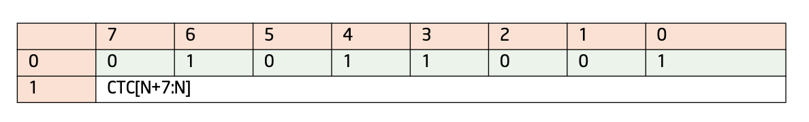

## 프로그램 실행에 관한 기본 정보를 담은 패킷

### 미니 타임 카운터 패킷 (  Mini Time Counter / MTC ) 
MTC 패킷은 wall-clock 시간의 경과를 주기적으로 제공합니다.

  MTC 패킷 구조
   
  

-> MTC 패킷은 Intel PT에서 **시간 정보를 추적**하기 위해 사용되는 패킷.   
프로그램의 실행 도중 일정한 간격으로 생성, 각 패킷은 **TSC( Time Stamp Counter )** 의 일부를 포함하고 있습니다.

TSC는 인텔 프로세서에 존재하는 64비트 내부 레지스터 최근 Reset으로 부터 CPU가 실행한 사이클 수를 저장하기 때문에, 경과 시간을 알 수 있다 ( wall-clock이 이런 뜻 인듯 )   

8비트 `CTC( Common Timestamp Copy )` 페이로드 값은 (ART >> N) & 0xFF로 설정됨( ART는 Always Running Timer로 프로세스 내부 타이머를 의미함 )

---

## 컨트롤 플로우 정보를 담은 패킷

### 플로우 갱신 패킷 ( Flow Update Packets / FUP )
FUP는 비동기 이벤트( 인터럽트 및 예외 ) 및 바이너리에서 송신지 주소를 확인할 수 없는 경우에 대한 송신지 IP 주소를 제공합니다.

  FUP 패킷 구조
   

-> 간단하게 이 패킷은 코드의 **실행 흐름 변경** 을 나타냅니다. 

실행 흐름 변경의 예시 ( 비동기 이벤트 )   
- 인터럽트 
  <!-- CPU가 현재 실행 중인 작업을 중단하고 인터럽트 처리 루틴을 실행하는 것. -->
- 예외 처리  
- 분기 명령어 

FUP 패킷에는 `IP( Instruction Pointer )`가 포함되어 있는데, 이 포인터는 실행 흐름이 변경된 지점의 주소를 가리킵니다.   

**따라서 FUP 패킷을 통해 어떤 명령이 프로그램의 실행 흐름을 변경했는지 알 수 있습니다.** 

 

---

 

### MODE 패킷
모드 패킷은 디코더가 디어셈블된 바이너리 및 추적 로그들을 올바르게 해석할 수 있도록 중요한 프로세서 실행 정보를 제공합니다.

-> 문서에서 설명하는 `MODE 패킷`은 총 2가지 `MODE.Exec`, `MODE.TSX` 

  일반적인 MODE 패킷 구조
   
  
   
  Leaf ID는 하위 비트에 어떤 MODE 비트 세트가 있는지를 나타냅니다.

- `MODE.Exec`
  

  MODE.Exec 패킷 구조
   
  
   
  MODE Leaf ID는 '000 입니다

  + `MODE.Exec` 패킷은 소프트웨어가 16비트, 32비트 또는 64비트 모드 중 어느 것을 사용하는지를 나타냅니다. 
  + `CS.D` 값과 `(CS.L & IA32_EFER.LMA)` 값을 제공함으로써 이루어집니다. 
  +  "Event Trace Support"가 활성화된 경우 인터럽트가 마스킹되었는지를 나타내기 위해 `RFLAGS.IF` 값을 제공합니다. 

   
  
   
  값에 따른 결과 값

- `MODE.TSX`

  MODE.TSX 패킷 구조
   
  
   

  + `TSX(Transaction Synchronization Extensions)` 패킷은 트랜잭션이 언제 시작되고, 커밋되며, 중단되는지를 나타냅니다.
  + `HLE(Hardware Lock Elision)`와 `RTM(Restricted Transactional Memory)` 두 가지 방식을 통해 구현 됨

   
  
   
  값에 따른 결과 값

 

---

 

## 소프트웨어에 의해 추가된 패킷들

### PTWRITE( PTW ) 패킷

PTW패킷들은 `PTWRITE` 명령에 전달된 피연산자의 값을 포함합니다.

  PTW 패킷 구조
   
  
   

-> `PTWRITE 패킷`은 Intel PT에서 제공하는 특별한 패킷으로, 사용자가 직접 추적 데이터에 정보를 삽입할 수 있도록 해줌

- ``PTWRITE`` 명령어를 사용하면, 이 명령어에 전달된 피연산자의 값이 PTWRITE 패킷으로 인코딩되어 추적 데이터에 삽입

- ``PTWRITE``를 사용하여 특정 함수가 호출된 시점을 명시적으로 표시하거나, 특정 변수의 값 변화를 추적하는 등의 작업이 가능

   
  
   

- PayloadBytes 필드는 헤더 바이트 뒤에 오는 페이로드의 바이트 수를 나타냅니다.

- IP 비트는 `PTWRITE` 명령어의 IP를 페이로드로 가질 FUP 패킷이 뒤따르는지 나타냅니다.

 

*PTWRITE는 어떻게 동작하는가?*

이 명령어는 소스 피연산자에서 데이터를 읽고, `TriggerEn`, `ContextEn`, `FilterEn`, `PTWEn`이 모두 1로 설정되어 있을 경우 Intel Processor Trace 하드웨어로 보내어 PTW 패킷에 인코딩됩니다.*

